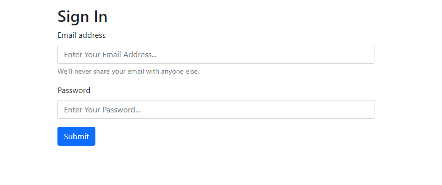

# Lonely Planet Publishing Books Online Selling Web Application!   

### About The Project:

- ##### This is a web based application for Lonely Planet publishing books, the concept of project is somehow like Amazon Books, or Turkish HepsiBurada and Trendyol applications. Customers (users) can sign-up and log-in the system. And then list and filter all the books they want for each category. 

- ##### Since this is a web applicaton, it also has administrator (management) panels. So the admin of the system can control all the system, add new book, update a book that already exists, delete a book or change a product's activity situation being up to it's stock number.

- ##### All the admin panel and customer operations are managed by database operations. All the informations abput all products, customers and admin are stored and managed inside the database so that this web application could be a dynamic web-site instead of static html web-site. 

### Technology That Is Used: 

- ##### The user interface of the project is designed, conceived and completed by HTML5 - CSS3 and Bootstrap. 

- ##### In order to make the application to gain dynamic attributes, PHP - PDO concept has been used. So that we can build the bridge between web application and our database system. The connection between the site and database has been provided by PHP - PDO and MySql technologies. So all the data is stored, kept and managed by MySql.

### What Is Lonely Planet ?

- #####  Lonely Planet believes that responsible travel can be a force for good. As a company, the only thing we want to do more than explore the world is protect it for future generations of travellers. So Lonely Planet helps people wishing to explore the world as well as protecting our future. 

### Contents
* [Homepage](#homepage)
* [Customer Register and Sign-In](#register-sign-in)

 
### Website Homepage 

There are 10 different regional destinations to travel, so there are 10 different region categories. 

- Asia Books
- Europe
- North America
- South America
- Africa
- Australia & Pacific
- Caribbean
- Central America
- Middle East
- Antarctica

Customer (user) can search products for the regional category. 

### Customer Register and Sign-In 

Customers(users) must reigster and sign-in in order to buy a product. This sign-in / register operations is provided by user interface at the front-end and a database system at the back-end. 

#### Register

#### Sign - In

#### Customer's List
This data is pulled from the database in a dynamic way. When a new user is registered, it is first added to database and then it is pulled back to website in order for admin to see the customers on admin panel. 

#### Customer's List Database View

- Database Name: customers
- Table Name: customersinfo
- Columns: id(Primary Key), name, surname, city, birthdate, email, password, gender.