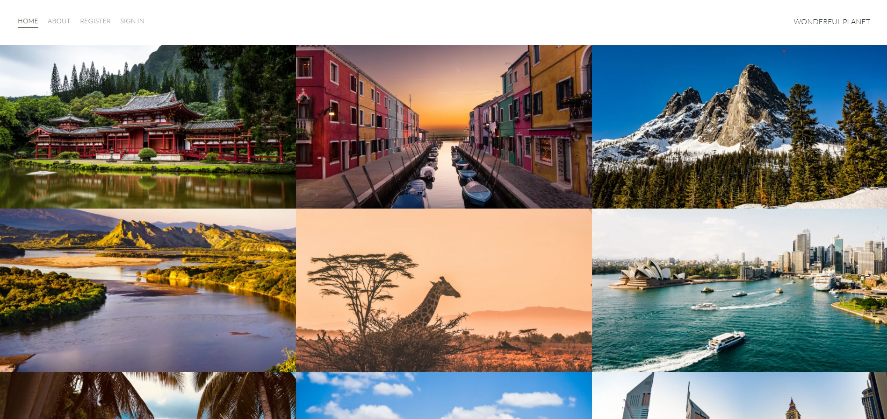
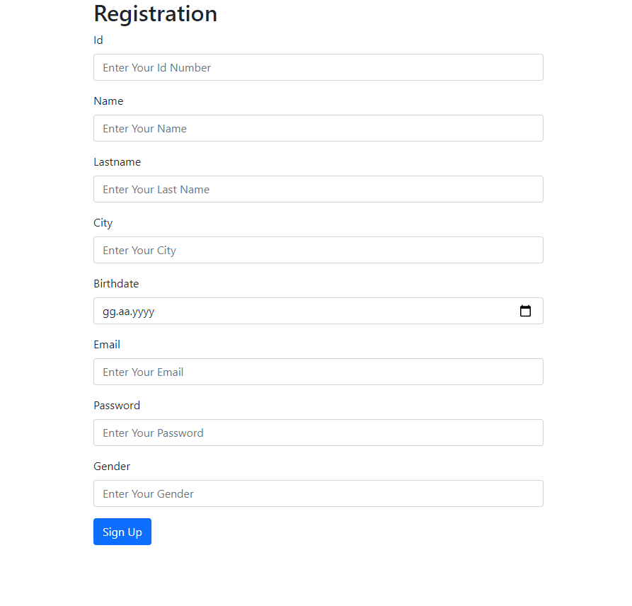
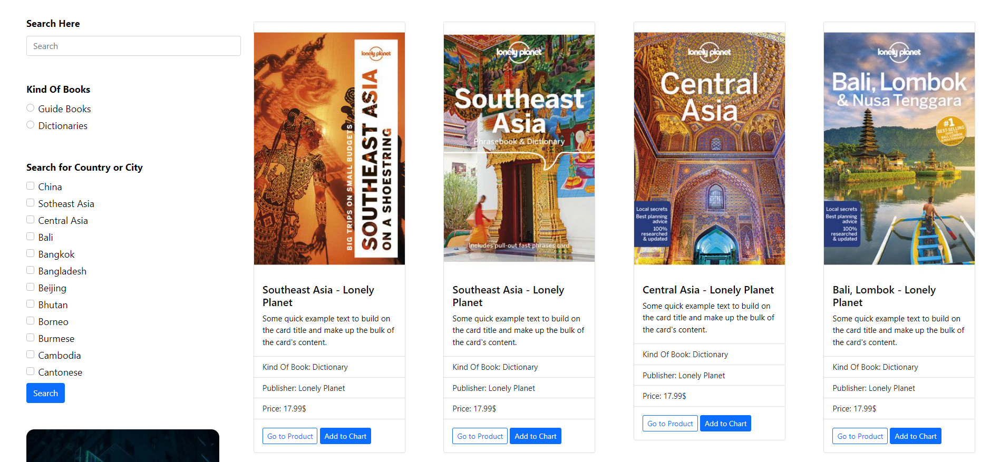
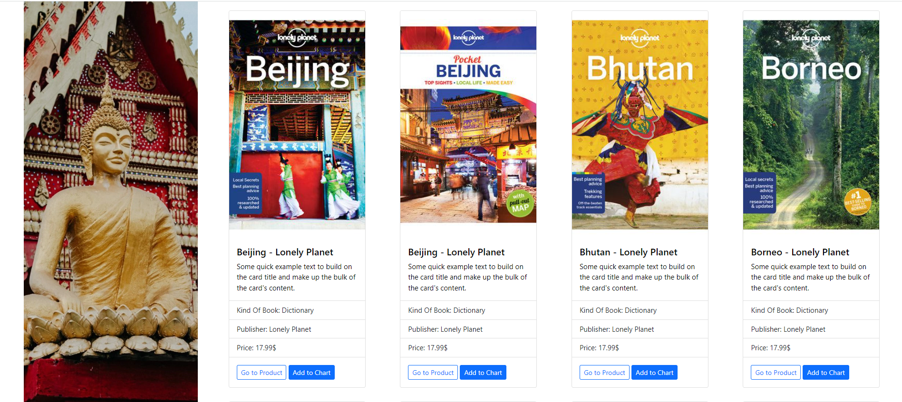
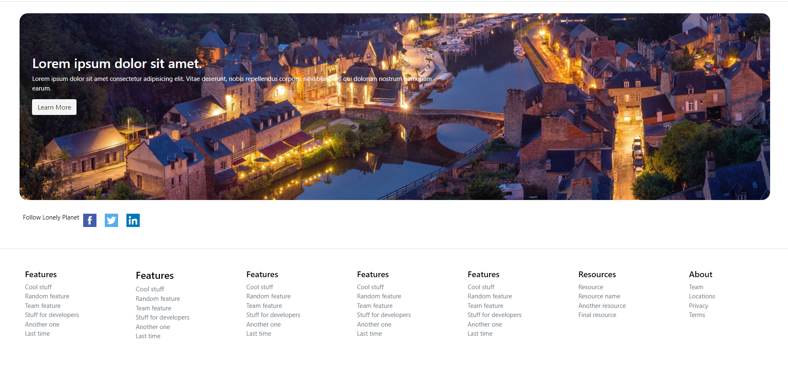
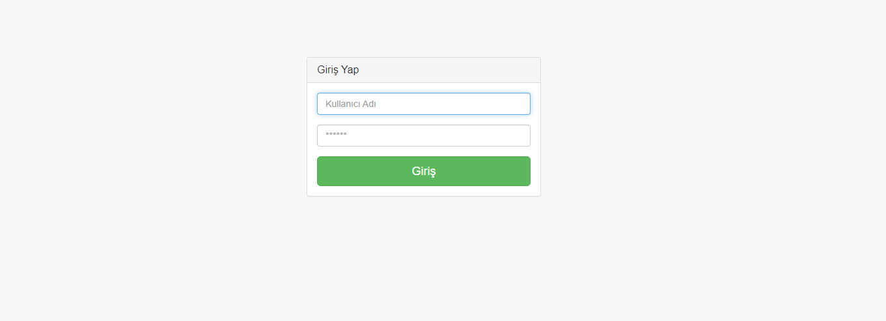
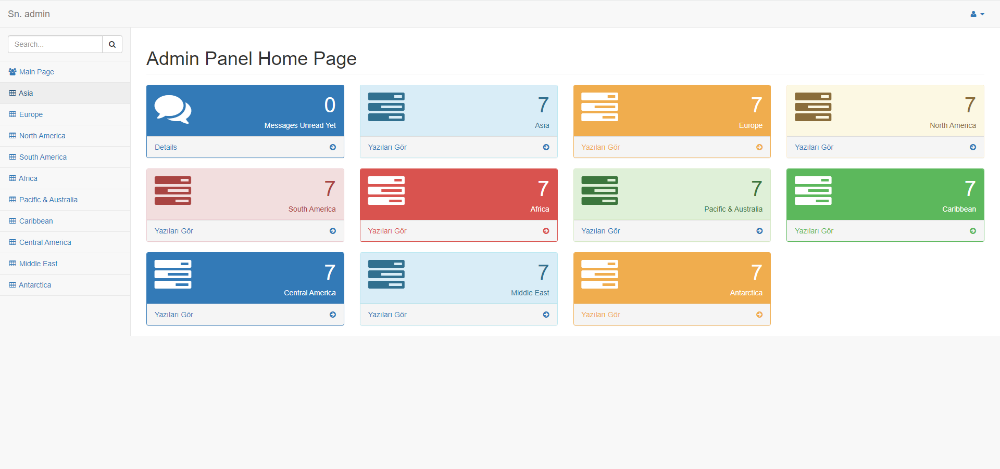
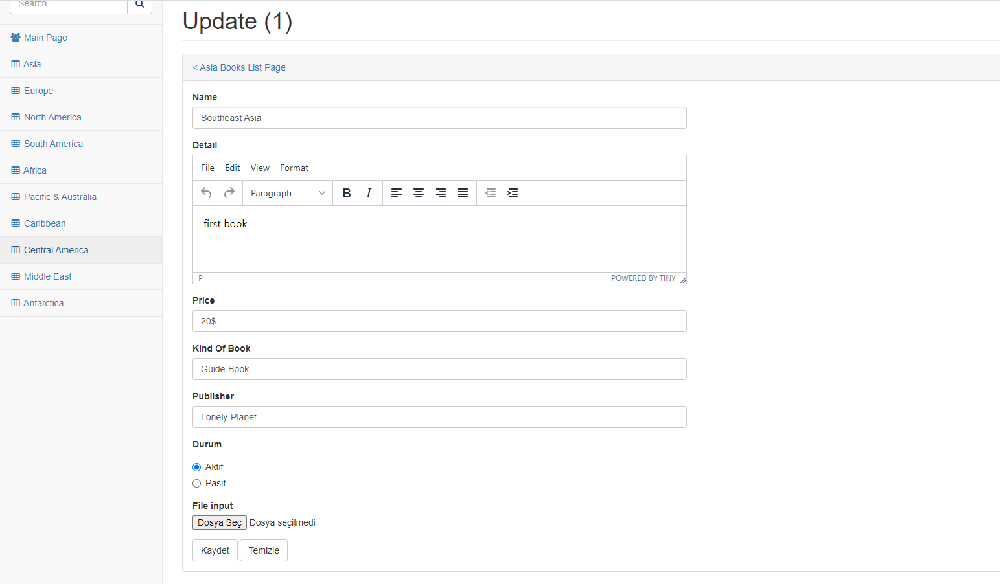

# Lonely Planet Publishing Books Online Selling Web Application!   

### About The Project:

- ##### This is a web based application for Lonely Planet publishing books, the concept of project is somehow like Amazon Books, or Turkish HepsiBurada and Trendyol applications. Customers (users) can sign-up and log-in the system. And then list and filter all the books they want for each category. 

- ##### Since this is a web applicaton, it also has administrator (management) panels. So the admin of the system can control all the system, add new book, update a book that already exists, delete a book or change a product's activity situation being up to it's stock number.

- ##### All the admin panel and customer operations are managed by database operations. All the informations abput all products, customers and admin are stored and managed inside the database so that this web application could be a dynamic web-site instead of static html web-site. 

### Technology That Is Used: 

- ##### The user interface of the project is designed, conceived and completed by HTML5 - CSS3 and Bootstrap. 

- ##### In order to make the application to gain dynamic attributes, PHP - PDO concept has been used. So that we can build the bridge between web application and our database system. The connection between the site and database has been provided by PHP - PDO and MySql technologies. So all the data is stored, kept and managed by MySql.

### What Is Lonely Planet ?

- #####  Lonely Planet believes that responsible travel can be a force for good. As a company, the only thing we want to do more than explore the world is protect it for future generations of travellers. So Lonely Planet helps people wishing to explore the world as well as protecting our future. 

### Contents
* [Homepage](#homepage)
* [Customer Register and Sign-In](#register-sign-in)
* [Asia Books Product Page Customer Layout](#asia-books-customer-panel)
* [Admin Sign-In Panel](#admin-sign-in)
* [Admin Panel Homepage Layout](#admin-homepage)
* [Admin Panel Asia Books General View Layout](#admin-asia-general)
* [Admin Panel Asia Books Add New Product Layout](#admin-asia-add)
* [Admin Panel Asia Books Update Product Layout](#admin-asia-update)
* [Admin Panel Asia Books Remove and Activ Operations](#admin-asia-remove-activ)
 
### Website Homepage 

There are 10 different regional destinations to travel, so there are 10 different region categories. 

- Asia Books
- Europe
- North America
- South America
- Africa
- Australia & Pacific
- Caribbean
- Central America
- Middle East
- Antarctica

Customer (user) can search products for the regional category. 

### Customer Register and Sign-In 

Customers(users) must reigster and sign-in in order to buy a product. This sign-in / register operations is provided by user interface at the front-end and a database system at the back-end. 

#### Register

#### Sign - In

#### Customer's List
This data is pulled from the database in a dynamic way. When a new user is registered, it is first added to database and then it is pulled back to website in order for admin to see the customers on admin panel. 

#### Customer's List Database View

- Database Name: customers
- Table Name: customersinfo
- Columns: id(Primary Key), name, surname, city, birthdate, email, password, gender.

### Asia Books Customer Panel Layout 

- All books that is belong to the region Asia is shown and listed here. Customers (users) can take a look at the products and they can add to cart if they want. All the dynamic operations here are managed by the database using MySql by the designer, administrator of the system. 

- Customers (users) can filter the books for their content, city, country or the name.

- As mentioned above, there are 10 different regions, destinations. So this "Asia Books Customer Panel" layout is just a sample, example of the other 9 regions. So that, other 9 regions's products are listed, shown and filtered with the same graphical user interface and provided by the same database operations.

### Admin Sign - In Panel 

- As told earlier, this is a dynamic e-trading web application. So, all the information, data about the customers and products is stored and managed by database and admin panel can be told to be the reflection of the database operations with the interface. So that, admin can add a new product, update a product that already exists and delete, or change the activity of the product with regard to it's stock number. For these operations, there is "Admin Panel" layout for the web application.

 

- This is the sign-in page for the admin of the system.

### Admin Panel Homepage Layout 

- As mentioned above, there are 10 regions, 10 main container categories. This panel can help the admin to reach the every category and than make changes on each of them.

### Admin Panel Asia Books General View Layout 

- As You can see above this is admin's management page for Asia Books, admin can add, update, delete and change activity of a product. This layout is just a sample of one category (Asia Books). The panel layouts for the other categories are exactly the same. 

### Admin Panel Asia Books Add New Product Layout 

- Admin of the system can add a new book clicking the button "Add New Book" here. The record of the new product is first added to the database and then, at the user interface, the data is pulled back to show the informations about the product. So, the operation of adding a new book is controlled in a dynamic way by the manager. 

 

- The inputs are equal to the columns at the table inside the database. 

### Admin Panel Asia Books Update Product Layout 

- Admin can update a prodoct clicking the button "Update" at the homepage of Asia Books at admin panel. The information record of the product clicked by the admin is shown at the inputs and then admin can make a change as however he/she wants. 

 

- New data is recorded first at the database and then at the user interface, the data is pulled back to show the new informations about the product.

### Admin Panel Asia Books Remove and Activ Operations 

- There is a button "Remove" here. If admin wants to remove a product completely, then he can use the button. So, when clicked, the record is deleted from the database and then it is no more shown at the user interface.

 

- There is a button "Active" here. If admin wants to remove a product temporariliy, maybe because of the absence of the stock, then he uses here. "Aktif" books are shown whereas "Pasif" books aren't at the user interface. 

